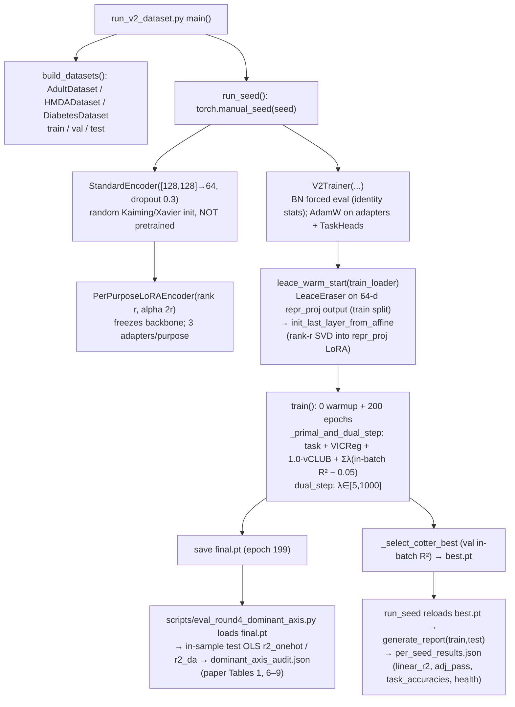
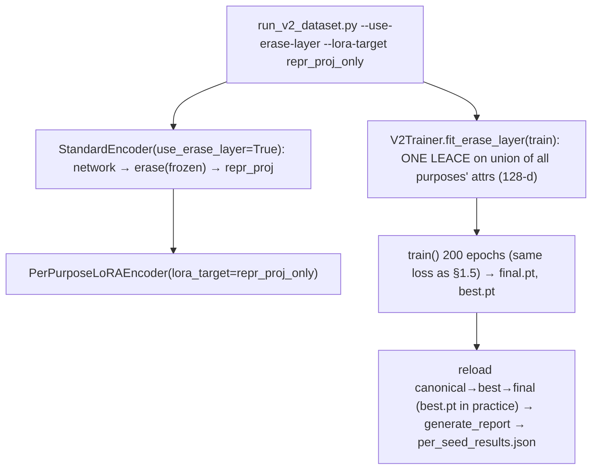

# PCRL encoder lineage: what actually ran

Role: METHODOLOGY (PCRL encoder lineage), Fork A. Written 2026-10-01. Source inspected read-only with
`git -C /Users/nathansamson/PCRL show <ref>:<path>`. No code was executed except a small synthetic numpy check
(section 1.7). Manuscript citations use the printed line numbers of the final NeurIPS PDF,
`Formatting_Instructions_For_NeurIPS_2026 (23).pdf` (text-identical to `(24).pdf`), written as "PDF(23) l.N".
Appendix tables have no printed line numbers and are cited by table and page.

Status markers:
- **[V]** verified from source at the stated ref and line.
- **[V-R]** verified from stored result files.
- **[NV]** not verified: the artifact is missing or was not inspected.

Refs used: headline tabular code is `b158abc54` (Round 7, Diabetes rank 24). That is the tip of the
Round 5 lineage `dbe0fdcc2` (lambda floor and warmup skip) plus `b3f43c53c` (Diabetes rank 16), and
`f542c06` (Round 6 per-class OvR). The same code is on `origin/main` (55e4cb1d1), which adds optional
erase-layer flags that default to off.

---

## 1. Tabular PCRL v2: the headline implementation (Adult/HMDA R5, Diabetes R7, 60 cells)

### 1.1 Entry point and provenance

- The entry point is `experiments/run_v2_dataset.py --dataset {adult,hmda,diabetes}` with the default
  seeds `[0,1,2]` and `--epochs 200` (b158abc54:experiments/run_v2_dataset.py:80, 413-468). **[V]**
- The EC2 user-data that invoked it was written to `/tmp/round5/userdata_*.sh` on the author's Mac and never
  committed (a00d5749b:experiments/round5_orchestrator.py:41-44). The exact argv and commit on the instance
  are therefore **[NV]**. Commit messages and `results/V2_ROUND5_SUMMARY.md` name `dbe0fdc` + `b3f43c5` for
  Round 5 and `b158abc` for Round 7.
- Results:
  - `results/v2_{adult,hmda}_ROUND5/` and `results/v2_diabetes_ROUND7/`. These hold `per_seed_results.json`
    written by the runner from **best.pt** (see 1.6).
  - `dominant_axis_audit.json` and `final_vs_best.json` were written by the re-evaluation scripts from
    **final.pt** (see 1.6).

### 1.2 Backbone: frozen, random initialisation, never pretrained

The backbone is built at `run_v2_dataset.py:214-216`:
`StandardEncoder(input_dim, hidden_dims=[128,128], repr_dim=64, dropout=0.3)`. **[V]**

`StandardEncoder` (b158abc54:pcrl/models/encoder.py:13-65) consists of:
- `network`: two blocks of [Linear → BatchNorm1d → ReLU → Dropout(0.3)].
- `repr_proj`: Linear(128→64), which produces the representation `h`.
- Initialisation: Kaiming-normal for the hidden layers and Xavier-normal for `repr_proj`, with zero biases
  (`_init_weights`, l.47-56).

No code path pretrains the backbone or loads backbone weights from elsewhere:
- `PerPurposeLoRAEncoder.__init__` freezes the backbone right after random construction
  (b158abc54:pcrl/models/lora.py:175-176).
- `V2Trainer` freezes it again and forces every BatchNorm into `eval()` permanently (v2_trainer.py:275-288, 392-397).
- The only `load_state_dict(ckpt["backbone"])` in the runner (run_v2_dataset.py:287) reloads the run's own
  `best.pt`.

**[V]** This independently confirms the claims audit (research/pcrl-claims-foundation-v1:
results/pcrl_claims_foundation_v1/METHOD_LINEAGE_NOTES.md:32-37; CORRECTIONS.md:19 T3-10).

BatchNorm is set to `eval()` before any forward pass, so its running statistics stay at the PyTorch defaults
(mean 0, variance 1). With affine parameters weight=1 and bias=0, BN is effectively the identity map times
1/sqrt(1+eps). The frozen "backbone" is therefore a seeded random ReLU feature map. The seed is
`torch.manual_seed(seed)` at run_seed:196, so each of seeds 0/1/2 uses a *different* random backbone.
Dropout(0.3) inside the frozen backbone stays active in train mode, because only BN is forced to eval.

The manuscript says otherwise: "The shared backbone is an MLP with hidden dimensions [128, 128], pretrained on
the union of allowed tasks. We freeze its weights and BatchNorm running statistics after pretraining" (PDF(23)
l.133-135; Table 4 "frozen after pretraining, BN frozen"). **This description is false for the code that
produced the headline.**

### 1.3 LoRA adapters: locations, rank, and trainable parameters

- **Placement.** For each purpose there is one `LoRAAdapter` per `nn.Linear` in the backbone: two hidden
  Linears plus `repr_proj`, so three adapters per purpose (lora.py:183-206). Each adapter adds
  `B(A(x))·(α/r) + bias` through a forward hook on the host Linear (lora.py:108-109, 208-225). **[V]**
- **Initialisation.** `A` is Kaiming, `B` is zero, and the adapter bias is zero.
- **Position relative to nonlinearities.** The hidden-layer adapters act *before* BN, ReLU and Dropout.
- **Rank and α.** `LORA_BY_DATASET` = adult (8, 16), hmda (8, 16), diabetes (24, 48) at b158abc54 (l.93-101).
  History: Diabetes was (16, 32) at b3f43c53c and f542c06 (Rounds 5 and 6), and rank 8 before that. **[V]**
- **Trainable parameters.** These are the adapters of all purposes plus the task heads, optimised with AdamW
  (lr 1e-3, weight decay 1e-4; v2_trainer.py:377-383). vCLUB q-nets have their own Adam optimiser. **[V]**
- **Task head.** `TaskHead(repr_dim=64, output_dim)` = Linear(64→64) → ReLU → … → Linear(…, n_classes)
  (task_head.py:42-45). This is a nonlinear head trained jointly with the adapters. **[V]**
- **Coupling across purposes.** Adapters are disjoint per purpose, but `clip_grad_norm_` is applied to the
  *joint* parameter list (v2_trainer.py:670-674). One purpose's large gradient therefore rescales every
  purpose's step. This is a small coupling that "drift on one adapter cannot propagate" (PDF(23) l.44-46)
  does not mention. **[V]**

### 1.4 LEACE warm-start: where it is fit and how it is realised

`V2Trainer.leace_warm_start(train_loader)` (v2_trainer.py:401-501) **[V]**:

1. The encoder is put in `eval()` and the last-layer adapter is zeroed. The procedure then collects the
   **64-d `repr_proj` output** of the random backbone on the **full train split** (shuffled loader; labels
   aligned in-batch).
2. For each purpose it builds the concatenated one-hot matrix of *that purpose's* disallowed attributes and
   fits `concept_erasure.LeaceEraser.fit(Z, A_oh)`.
3. It realises `Q z + (I−Q)μ` at the output through `init_last_layer_from_affine` (lora.py:236-304):
   - rank-r SVD truncation of `(Q−I)W_repr` into the `repr_proj` adapter's A and B;
   - the adapter bias absorbs `(Q−I)b + c`;
   - the hidden-layer adapters stay at zero.

Truncation is exact only if rank(Q−I) ≤ r. Adult employment_analysis has
race(5) + age_group(4) + marital_status(**2** in code; the paper says 7, PDF(23) l.570) = 4+3+1 = 8 ≤ 8.
Diabetes quality_research has 13 ≤ 24.

**Erasure point and what follows it.** `h_p` is the output of `repr_proj`, plus its adapter. Nothing follows
it inside the encoder: no BN, activation or dropout. At construction, `h_p` is exactly the LEACE-erased
feature (up to truncation), so train-split covariance with the purpose's attributes is about 0. The LEACE fit
is not maintained during training, however:

- all three adapters per purpose train, including the hidden-layer adapters *upstream* of BN/ReLU;
- after epoch 0, zero covariance holds only to the extent that the R² constraint enforces it.

So no covariance-zero guarantee applies to the trained `h_p`, and the "final-layer rank-edit" argument
(Proposition 2 / Proposition 4) does not describe the trained model, which adapts every layer. **[V]**

### 1.5 Loss, constraints, and schedule (as run)

The primal loss is (v2_trainer.py:652-661) **[V]**:

`L_task + 1.0·L_VICReg + λ_vCLUB·L_vCLUB + 0·L_HSIC + 0·L_verify + Σ λ_{p,a}(R²_{p,a} − 0.05)`

The table below compares each item with Table 4 of the paper.

| Item | Code (as run) | Paper (Table 4, PDF(23) p.16) | Match |
|---|---|---|---|
| λ_VICReg, λ_var, λ_cov, γ | 1.0, 1.0, 0.04, 1.0 (run_v2_dataset.py:246-248; v2_trainer.py:157-159) | same | yes |
| **λ_vCLUB (constrained phase)** | **1.0**, passed explicitly at run_v2_dataset.py:246 (also at dbe0fdcc2:211, b3f43c53c:225, f542c06:244, origin/main:277). `VCLUB.mi_upper_bound` is not detached: "Encoder backprops through this" (vclub.py:100-116) | "0.0 (logged only)" | **NO** |
| λ_HSIC | 0.0 (config default, v2_trainer.py:106) | 0.0 | yes |
| R² constraint | **in-batch** (batch 256) ridge one-hot R², ridge 1e-4 (`VerificationRegularizer`, losses.py:475-541) | "linear-R² (closed-form ridge)" | partial: the batch-level estimator is not stated |
| Per-class OvR | K ≥ 6, so Diabetes age_bucket only: 10 separate constraints (v2_trainer.py:326-374) | K ≥ 6 | yes |
| Duals | λ0 = 1, η = 0.02, cap 1000, floor λ_min = 5 (proxy_lagrangian.py:93-100) | same | yes |
| Dual update | plain projected gradient ascent on the same in-batch R² (`dual_step`), i.e. a standard Lagrangian GDA rather than Cotter's two-player proxy game | "Following Cotter et al." | partial |
| Warmup | K_w = 5, but **skipped** when `leace_init=True` (v2_trainer.py:850-853), so 0 warmup epochs | "5 (skipped when … feasible)" | yes. The code skips unconditionally whenever LEACE init is on; there is no feasibility test. |
| Epochs, stopping | 200 constrained epochs, no early stopping | 200 | yes |
| Batch, optimiser | 256, AdamW lr 1e-3, wd 1e-4, clip 1.0 | Adam lr 1e-3, wd 1e-4 | minor |

### 1.6 Checkpoint selection: which checkpoint each number comes from

- The trainer saves `final.pt` (epoch 199) and then `best.pt` from the "true Cotter" selector. The selector
  picks the feasible iterate with minimum val task loss; if none is feasible, it picks the minimum val
  violation within 10% of the best val task loss (v2_trainer.py:911-986). Feasibility uses **val in-batch
  R²** averaged over val batches (v2_trainer.py:797-832, 886-909). **[V]**
- The runner reloads **best.pt** and writes `per_seed_results.json` (`linear_r2`, `adj_pass`,
  `task_accuracies`, health) from it (run_v2_dataset.py:283-325). **[V]**
- The paper's compliance tables (Tables 1 and 6-9; 56/60) come from
  `scripts/eval_round4_dominant_axis.py`, which loads **final.pt** (origin/main:scripts/eval_round4_dominant_axis.py:136-138)
  and writes `dominant_axis_audit.json` (`per_seed.<s>.epoch = 199`). **[V-R]**
- The **utility** numbers are `summary.json:task_acc_mean`, and `results/v2_adult_ROUND5/task_acc_vs_unconstrained.json`
  uses `pcrl_per_seed` equal to `per_seed_results.json:per_seed[*].task_accuracies`. These come from
  **best.pt**. **[V-R]**
  - Example: Adult s0 income 0.768592 appears in both files.
  - best.pt epochs: Adult R5 158/188/147, HMDA R5 30/78/191, Diabetes R7 197/80/176. Most are "fallback"
    selections with n_feasible = 0 out of 200.
  - **Compliance and utility are therefore reported from different checkpoints.**
  - `final_vs_best.json` stores no task accuracy for final.pt.
- Round 4 history: the Cotter fallback chose epoch 11-12 on every Adult seed (`v2_adult_ROUND4/per_seed_results.json`).
  The authors then switched to final.pt *after* seeing the test-set auditor numbers
  (`results/v2_adult_ROUND4/cotter_selection_bug.md`: "We adopt final.pt as the canonical Round 4 result").
  The paper's "final iterate" (PDF(23) l.173-176) is thus a rule adopted post hoc. **[V-R]**

### 1.7 R² estimators at each stage

| Stage | Estimator | Data | Location |
|---|---|---|---|
| Training constraint, dual | ridge (1e-4) one-hot OLS fit and scored **in the same 256-row batch** | train batches (dropout on) | losses.py:496-541; v2_trainer.py:619-650 |
| Cotter feasibility | mean over val batches of in-batch R² (OvR max for high-K) | val | v2_trainer.py:797-832 |
| Headline audit (`r2_onehot`, `r2_da`) | ridge (1e-6) OLS **fit and scored on the full test split** (in-sample on test) | test | certificates.py:426-498 (`LinearAudit.audit(test_reprs, test_labels)`); eval_round4_dominant_axis.py:172-173 |
| Empirical auditor Δ | LR/MLP/XGB etc. fit on ≤ 20K train rows, scored on test; majority from train+test | train → test | certificates.py:366-423, 518-530 |

**Synthetic check** (numpy, not repo code; ridge 1e-4, n = 256, labels independent of H). The expected
in-batch one-hot R² is about k/(n−1), where k is the batch rank of H:

| Rank of H (64-d) | Expected in-batch R² |
|---|---|
| 64 | 0.249 |
| 32 | 0.126 |
| 13 | 0.052 |
| 8 | 0.031 |
| 3 | 0.012 |

A full-rank 64-d representation that carries **no** information about A therefore violates the training
constraint (0.25 > τ = 0.05). Under this estimator the constraint is satisfiable only when the batch rank of
the representation is about 12 or lower. This mechanism, inherent to the estimator itself, is enough to drive
the reported "compliance via collapse" (effective rank 1-3, per_dim_std < 0.5). It is not discussed in the
paper, which attributes the collapse to the λ_min floor and to Proposition 4 (PDF(23) l.283-291). **[V]**
(synthetic only, not rerun on checkpoints)

### 1.8 Data splits and preprocessing (headline tabular)

**Adult** (b158abc54:pcrl/data/adult.py:175-207, 309-345) **[V]**
- Split: train and val come from a permutation of `adult.data` with `np.random.seed(42)` (80/20); test is the
  official `adult.test`. Rows with missing values are dropped. Sizes: n_train = 24,145 (results/adult_LEACE/leace_baseline.json).
- Features: 6 z-scored numericals plus one-hot `workclass, education, marital-status, occupation,
  relationship, race, sex, native-country`.
- Tasks are deterministic recodings of input features:
  - `occupation_group` = `occupation` mapped to 6 groups;
  - `education_level` = `education` mapped to 4 levels.
  - Hence about 99% task accuracy (`results/laftr_benchmark/PCRL_R5_COLLAPSE_DIAGNOSIS.md` §Q4 says the same).
- Disallowed attributes race, sex and marital-status are input features. marital_status is **binary**
  (`MARITAL_BINARY`); the paper says 7 classes.

**HMDA** (b158abc54:experiments/prepare_hmda.py) **[V]**
- Cohort: CA 2023 LAR, action_taken ∈ {1, 3}, with filters.
- Split: deterministic 70/15/15 permutation, seed 42 (split_indices). n_train = 63,747, so about 91.1K rows in total.
- Normalisation statistics use the train split only.
- `tract_denial_high` is a per-tract denial rate thresholded at the median, computed over **all rows,
  including val and test** (prepare_hmda.py:33-37, 395-401). Each row's label depends on held-out rows'
  outcomes and on its own `action_taken`, which is also the `loan_decision` label.
- race, ethnicity and sex are input features.
- Purposes in code: underwriting {race(5), ethnicity(**2**)}, pricing {race, sex}, fair_lending_audit {race, sex}.

**Diabetes** (b158abc54:experiments/preprocess_diabetes.py) **[V]**
- Cohort: **deduplicated to the first encounter per `patient_nbr`** (l.220-222), giving n_train = 50,053, so
  about 71.5K rows. The paper says "101,766 inpatient encounters" (PDF(23) l.578).
- Split: 70/15/15 stratified on readmission, seed 42.
- `medication_change_outcome` = (`change` == "Ch"), which is a function of the 23 medication columns used as
  features. This explains test accuracy of about 0.999.
- age_bucket is both an input feature and a disallowed attribute.

**Manuscript task descriptions do not match the code** (PDF(23) l.568-583, App. H):

| Purpose | Paper says | Code uses |
|---|---|---|
| HMDA pricing_analysis | "predicting interest rate" | `loan_amount_band` (loan-amount quintile) |
| HMDA fair_lending_audit | "predicting denial reason" | `tract_denial_high` |
| HMDA fair_lending_audit, disallowed set | the "auditor must see race" (l.19-23, 88-92) | race is **disallowed** |
| Diabetes quality_research | "predicting A1C result" | `readmission_outcome`; A1C is an input feature |

The motivating underwriter-versus-auditor conflict is **not instantiated** in the HMDA registry: race is
disallowed in all three purposes. **[V]**

### 1.9 Utility protocol (Q8)

- "Task accuracy within 1pp of the unconstrained backbone" (PDF(23) l.55, the contributions paragraph) is
  compared against a different model:
  - `results/{hmda,diabetes}/standard_ceiling.json` comes from `experiments/run_standard_ceiling.py`: an
    end-to-end **trained** StandardEncoder, **single seed 0**, early-stopped on val, evaluated on test.
  - The Adult comparator is 0.8495 from `results/adult/extended_baselines.csv` ("Standard (no privacy)").
  - Neither is the frozen random backbone that PCRL uses.
- The PCRL side is the trained nonlinear task head on best.pt test representations; heads are not refit.
- The repository's own comparison (`results/v2_adult_ROUND5/task_acc_vs_unconstrained.json`, sha256 prefix
  0b748c5af38a5b00) gives `within_1pp` = **2 of 7** comparable tasks. The gaps are:

  | Task | Gap |
  |---|---|
  | Adult income | −6.22pp |
  | HMDA loan_decision | −1.44pp |
  | HMDA loan_amount_band | −11.56pp |
  | HMDA tract_denial_high | −2.44pp |
  | Diabetes primary_diagnosis | −12.85pp |

- `PCRL_R5_COLLAPSE_DIAGNOSIS.md` (committed by 135e440e6 on 2026-05-05, before the 2026-05-07 PDF) says the
  1pp claim "does not hold". It also reports that HMDA fair_lending and Diabetes quality_research task
  accuracies equal the majority rate exactly on all seeds. **[V-R]**
- **Test-set use in development:**
  - The R5 and R7 verdicts and the Round 4 final-vs-best switch read the **test** split through
    `generate_report` (eval_round4_final_vs_best_v2.py:46-58, 88-91).
  - Rank 16 → 24, the per-class OvR fix (K ≥ 6), λ_min = 5 and warmup-skip were each adopted after test-split
    auditor results (`V2_ROUND5_SUMMARY.md`, `V2_DIABETES_ROUND7_VERDICT.md`, commit messages 2efd2a379,
    8b2125f9b).
  - The paper discloses post-hoc selection on "the same 60-cell grid" (footnote 1 p.6; l.248-257, 356-360).
    It does not say that the grid's R² is computed on the **test** split.
  - The "held-out validation on Adult seed 3" (l.364-371) holds out only a seed: it uses the same data split
    and the same test set (`results/v2_adult_HELDOUT_S3/per_seed_results.json`, seeds [3]; Cotter fallback
    epoch 7). **[V-R]**
- **Software environment:** `requirements.txt` gives only lower bounds (`torch>=2.0.0`,
  `concept-erasure>=0.2.0`, …). There is no lock file, and the instance AMI is ami-05603a42e5254c4bb
  (orchestrator l.82). Exact versions are **[NV]**.

### 1.10 Verified call graph: tabular v2 headline (b158abc54)

---

## 2. Erase-layer pilot (rebuttal; erase-layer-pilot-2026-05-17 @ 65dd5c050, merged to main via ee0c91c83)

This is a **separate implementation, not in the NeurIPS PDF.** **[V]**

- `StandardEncoder(use_erase_layer=True)` inserts a frozen `nn.Linear(128,128)` `erase` between `network`
  (…→ReLU→Dropout) and `repr_proj`, marked `_skip_lora` (erase-layer-pilot-2026-05-17:pcrl/models/encoder.py:46-63, 89-98).
  `lora_target="repr_proj_only"` restricts the adapters to `repr_proj` (lora.py:162-205).
- `V2Trainer.fit_erase_layer` fits **one shared LEACE eraser on the union of every purpose's disallowed
  attributes** on the 128-d train features (v2_trainer.py:520-604).
  - The per-purpose `leace_warm_start` is skipped (rebuttal-evidence:experiments/run_v2_dataset.py:318-330).
  - For Adult the union is {race, sex, age_group, marital_status, **income**}, so the income_prediction
    purpose's own task label is linearly erased from its representation.
  - This turns PCRL into a single-removal-set representation, which is the design the paper argues against
    (PDF(23) l.62-68).
- After the erase layer come only linear maps (`repr_proj` + LoRA), so train-split covariance with the union
  attributes is exactly about 0 at evaluation. Test-split R² is not guaranteed, but it is small in practice.
- Task utility collapses on the deterministic tasks. Adult pilot `task_acc_mean`: occupation 0.753 (was 0.992),
  education 0.834 (was 0.9995) (local `results/rebuttal/erase_layer_pilot_aws/v2_adult_ERASE_PILOT/summary.json`). **[V-R]**
- Checkpoint: pilot `per_seed_results.json` came from best.pt (Cotter fallback, e.g. Adult s0 epoch 183), not
  final.pt. The "54/60 → 60/60" comparison therefore does not use the paper's final-iterate rule (see the
  recount fork for the counts).

## 3. CelebA PCRL-V (separate implementation; origin/main pcrl/vision/*)

- **Backbone.** `resnet18(weights=ResNet18_Weights.IMAGENET1K_V1)`, i.e. ImageNet-pretrained (this one *is*
  pretrained, on ImageNet). Fully frozen, with BN frozen through `timm.layers.freeze_batch_norm_2d`
  (origin/main:pcrl/vision/backbone.py:43-59). **[V]**
- **Architecture** (`ResNet18EraseTaskLoRA`, backbone.py:29-83): post-avgpool 512-d → `erase` (frozen
  Linear 512×512, LEACE-fit) → `task_proj` (identity-init Linear 512×512, PEFT LoRA r = 8, α = 16,
  dropout 0.05) → head Linear(512, 2) for Smiling. **[V]**
- **LEACE fit.** On (Male, Young) one-hot, using a 60K stratified subsample of the official train partition
  (`CelebAMedium`, dataset.py:88-122; `train_set_r2.json:n_samples = 60000`). The erase layer has rank about
  2 (top singular values 4.89, 4.31, then about 1e-6; preflight.json). **[V-R]**
- **What follows the erasure** is linear only (task_proj + LoRA). A covariance of exactly zero therefore holds
  on the LEACE fit sample. The reported "train-set R² ≤ 0.005" (PDF(23) l.338) is measured on that **same
  60K sample** and is about 0 by construction.
- **Producer script not committed.** The script that wrote `results/v2_celeba_R5_*` is absent: the key
  `train_set_r2` appears only in results. The training loop is `pcrl/vision/train.py`. **[NV]** for exact argv.
- **Per-epoch val-loader R²** (`_evaluate_r2`, train.py:115-146, 313-314; in-sample OLS on val
  representations): Male 0.156/0.157/0.164 and Young 0.171/0.156/0.167 for seeds 0/1/2. These values are
  constant across all 25 epochs, and `n_feasible_epochs = 0`, so the selector falls back to the final epoch
  (`training_log.json`). **[V-R]**
  - By the tabular protocol's own measure (in-sample OLS on a held-out split), CelebA **fails τ = 0.05** on
    every seed.
  - Caveat: the val n is not recorded. If val n ≈ 4K, the in-sample d/n bias for d = 512 is about 0.12, and
    that bias would explain most of the 0.16. The preflight `holdout_r2` at construction was 0.0105
    (probe_n = 60000).
  - **Neither the train-sample 0.003 nor the val 0.16 is a valid out-of-sample leakage estimate.** A
    cross-fitted estimate is needed.
- **Nonlinear attackers** (`cross_purpose.json`, trained, seed 0): MLP "R²" for Male 0.862 and XGB 0.844.
  Male stays highly recoverable. The paper frames the comparison only as trained ≤ LEACE-init (Table 11). **[V-R]**
- **Optimisation.** λ_min = 5, λ_init = 5, 25 epochs, `skip_warmup_if_feasible = false` (training_log.json:config).

## 4. BIOS (not in the final manuscript)

The final PDF(23) contains no BIOS experiment; the earlier source (21)/PDF(22) mentioned one. Branch
`bios-pcrl-layer12-2026-05-05`:
- frozen `bert-base-uncased` (pretrained), PEFT LoRA on Q/V in all layers, plus a last-layer projection
  (pcrl/language/bert_encoder.py:1-121);
- result: R²(gender) stayed at 0.946 across 5 launches (`results/bios_layer12/NEGATIVE_RESULT_NOTE.md`). **[V-R]**

## 5. Baselines (brief)

- **INLP** (`scripts/run_inlp_benchmark.py`, `pcrl/baselines/inlp.py:320-400`):
  - pre-trains a StandardEncoder plus head on task loss (a **trained** encoder, unlike PCRL's random frozen
    backbone), then runs sequential per-attribute INLP on 64-d representations;
  - the stopping rule uses the **val** split (the docstring says "test");
  - the head is then refit.
  - PDF(23) l.730 ("the same MLP-128-128-64 backbone PCRL uses anchors all three methods") is true of the
    architecture only, not of the weights or training. **[V]**
- **LAFTR** (`scripts/run_laftr_benchmark.py`): a trained StandardEncoder with MLP discriminators. **[V]**
  (header only)

---

## 6. Integration addendum (parent methodology role, from the CelebA/data sub-audit)

These points refine §3. They were taken from source and stored results at origin/main 55e4cb1d1. Nothing
was rerun.

- **There are two separate CelebA implementations. Only the second is in PDF(23).**
  - **(a) 64px multi-purpose pipelines, Mar–Apr 2026.** These are `pcrl/data/celeba.py`,
    `experiments/run_celeba.py`, `run_celeba_v2.py`, `run_celeba_ensemble_*`, `run_concat_celeba.py` and
    `run_celeba_impossibility.py`.
    - The conv backbone (32/64/128) is trained from scratch and uses adversarial `PCRLTrainer`.
    - There are five purposes, in which Male/Young/Attractive/Smiling are allowed under one purpose and
      disallowed under another (`celeba.py:133-188`).
    - The data are file-order `head()` prefixes of the official partitions: 10K/3K/3K, or 15K/5K/5K
      (`celeba.py:76-88`).
    - Results are in `results/celeba/*.csv`. **[V]**
  - **(b) CelebA-medium "PCRL-V"**, `experiments/run_celeba_medium.py --train --arch erase_task`.
    - It has **one purpose only** (task Smiling; hide Male and Young). No second purpose exists, so the
      App. N "cross-purpose attack" is a nonlinear attack on a single representation. **[V]**
    - The val loader is a **4,096-image** stratified subsample of official partition 1 (`val_n` default 4096,
      `run_celeba_medium.py:420-462`). This resolves the "val n unknown" in §3. In-sample OLS with d = 512 on
      n = 4096 has a chance floor of about d/n = 0.125. Adjusted R² of the stored 0.156–0.171 is about
      0.035–0.052. **[V-R]**
- **The trainable path after the erase layer is linear.** It is `task_proj` (W = I + BA) followed by a Linear
  head. Linear R² of the representation is therefore invariant to training up to the invertibility of W, and
  the stored val R² moves by less than 1e-3 across 25 epochs while the duals climb to about 220.
  - The proxy-Lagrangian has no lever on the quantity it constrains.
  - PCRL-V is functionally "LEACE on frozen ImageNet ResNet-18 features plus a linear probe". **[V] + [V-R]**
- **The checkpoints do not contain the erase layer.** The relocated `final.pt` files are 42,185 B each,
  enough only for the LoRA plus the head. Reconstructing the model requires refitting LEACE, and that refit is
  non-deterministic because the fit loader applies random flips.
- **The evaluation scripts are missing.** The scripts that wrote `train_set_r2.json` and `cross_purpose.json`
  are in no git ref. **[NV]**
- **The two sub-audits report different erase-layer rank diagnostics.** The §3 note gives about rank 2 from
  the preflight singular values. `train_set_r2.json` and the preflight record `rank_M` = 60–61, against an
  "expected ≤2" comment. That suggests a numerical-tolerance artifact or a different quantity. Unresolved;
  it does not affect the reported R² values.
- **No identity linkage.** `identity_CelebA.txt` is not used by any code path and is not present locally or
  in the relocation inventory.

### Separate-implementation summary (do not merge these)

| Implementation | Backbone | Erasure location | What follows erasure | Trained params | Checkpoint used for reported numbers |
|---|---|---|---|---|---|
| Tabular v2 headline (R5/R7) | frozen **random** MLP [128,128]→64, BN at default stats, dropout 0.3 active | LEACE realised into `repr_proj` LoRA at init only | nothing nonlinear after h_p. However, LoRA on **every** Linear (incl. pre-BN/ReLU hidden layers) is trained, so erasure is not maintained | all-layer LoRA + task heads (+ vCLUB nets, λ=1.0) | compliance: final.pt; utility/health: best.pt |
| Erase-layer pilot (rebuttal) | same random MLP | one frozen LEACE on the **union** of all purposes' attributes, 128-d, before `repr_proj` | linear only (`repr_proj` + LoRA) | `repr_proj` LoRA + heads | best.pt (Cotter fallback) |
| Cross-purpose retrain (rebuttal, d39211214) | same as erase pilot + concat constraint | union LEACE | linear only | as above | best.pt (Diabetes = epoch 0) |
| CelebA PCRL-V | frozen ImageNet ResNet-18 (BN frozen) | frozen LEACE on Male/Young, 512-d | linear only (task_proj LoRA + head) | LoRA + head | final epoch (0 feasible) |
| CelebA 64px (not in PDF) | CNN trained from scratch | none (adversarial) | — | all | various |
| BIOS layer-12 (not in PDF) | frozen BERT-base (pretrained) + PEFT LoRA on Q/V in all layers + last-layer projection | not audited this phase [NV] | not audited [NV] | LoRA + projection | negative result (R²(gender) 0.946) |
