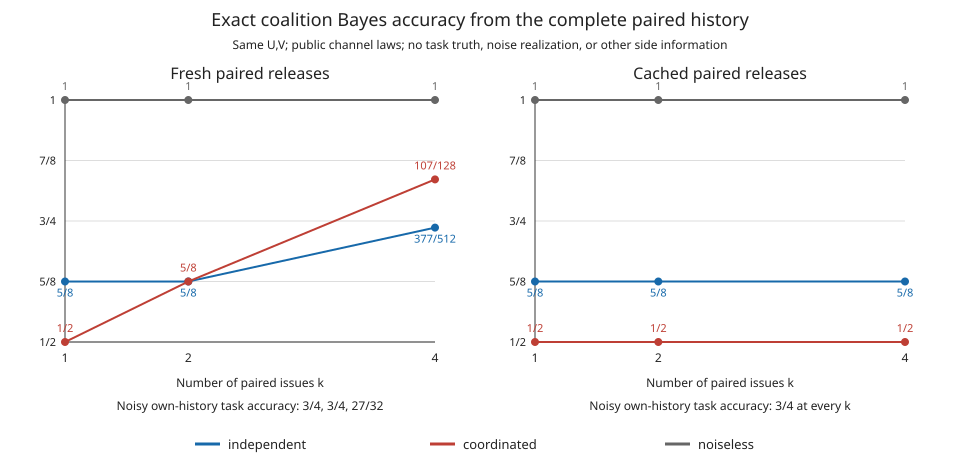

# Exact coordination: one release improves, fresh repetition reverses the comparison

At identical 75% single-purpose accuracy, coordinated errors reduce one-pair Bayes recovery of S from 5/8 to 1/2. This improvement does **not** survive fresh repeated paired releases of the same task bits: at four calls, coordinated recovery is 107/128, exceeding independent recovery 377/512. Each purpose's complete history nevertheless remains independent of S, and its authorized task accuracy is identical under the two mechanisms. No representation learning is needed for either result.

This is a finite calculation for declared signs, channels and access. It is not a new theorem, a privacy certificate for ACS, an argument that all independently designed mechanisms fail, or evidence that representations outperform coordinated predictions.

| Issuance | Channel | Coalition accuracy k=1 | k=2 | k=4 | Own-task accuracy k=1,2,4 |
| --- | --- | ---: | ---: | ---: | --- |
| Fresh independent pairs across time | Product noise within a pair |5/8|5/8|377/512|3/4,3/4,27/32|
| Fresh independent pairs across time | Coordinated noise within a pair |1/2|5/8|107/128|3/4,3/4,27/32|
| One cached pair, repeatedly returned | Product noise |5/8|5/8|5/8|3/4,3/4,3/4|
| One cached pair, repeatedly returned | Coordinated noise |1/2|1/2|1/2|3/4,3/4,3/4|
| Either issuance policy | Noiseless |1|1|1|1,1,1|

Every individual-history S accuracy is 1/2 in every row. The noised four-call utility is 27/32=84.375%; independent coalition recovery is 73.6328125%, coordinated 83.59375%. The last difference is 51/512, about 9.96 percentage points. Two fresh coordinated calls already increase coalition recovery to 5/8 while each own-task accuracy stays 3/4.



## Definitions and access

U,V are independent uniform signs and S=UV. A paired issue gives purpose 1 R1=UN1 and purpose 2 R2=VN2. Each recipient sees only its own complete history. The coalition sees both histories for the same U,V, including which entries were jointly issued. Laws and policies are public; realized noise, true U,V and additional side information are not released. Utility decoders receive only their own histories, not the other purpose's output or true task label. The toy's true task values are available to the exact evaluator, not to the modeled recipients.

Noise is independent of U,V. In `(N1,N2)=(++,-+,+-,--)` order the product law is `(9/16,3/16,3/16,1/16)` and the coordinated law `(1/2,1/4,1/4,0)`. Both have marginal sign error 1/4. Independent here specifically means independent within-pair randomization. Independently designed mechanisms could agree on this coordinated law; the result is not a lower bound for all independent design procedures.

Fresh means new noise pairs, independent across time but with their declared within-pair dependence. Cached means draw once and return the same pair on every request. This cache is an exact mathematical issuance policy. It does not address linkability, changing underlying values, fresh model versions, cache resets, hidden extra releases or arbitrary auxiliary information.

## Single-pair derivation from the full joint

Write p(n1,n2) for the public noise law and r=(r1,r2). Then

\[
P(S=s,R=r)=\frac14\sum_{u\in\{-1,+1\}}p(r_1u,r_2su).
\]

Let c=P(N1N2=+1). The right-hand side equals c/4 when s=r1r2 and (1−c)/4 otherwise. Every output pair has probability 1/4. Consequently the optimal coalition accuracy, summed over all four possible output pairs, is max(c,1−c).

For product noise c=(3/4)²+(1/4)²=5/8. The product R1R2 is the Bayes decoder and has accuracy 5/8. For coordinated noise c=1/2, so **all eight cells** P(S=s,R=r) equal 1/8; S and the entire output pair are independent and Bayes accuracy is 1/2. This is a full-distribution statement, not zero covariance. Noiseless releases have c=1 and determine S exactly.

For either single view, P(S=s,Ri=r)=1/4 for all four cells: U and V each remain uniform when S is fixed, and the view's noise is independent of the task bits. With error 1/4, predicting the task sign by its released sign has accuracy 3/4 and is Bayes optimal for its symmetric channel.

## Decoder errors impose a coalition lower bound

Suppose arbitrary purpose decoders produce U-hat and V-hat with population errors q1 and q2. The coalition can multiply their predictions. A parity error requires exactly one task error, hence

\[
P(\widehat U\widehat V\ne UV)
=P(E_1\triangle E_2)\le P(E_1\cup E_2)\le q_1+q_2.
\]

It can also ignore the outputs and guess the balanced S. Its optimal accuracy is therefore at least max(1/2,1−q1−q2). Exact authorized recovery of both U and V forces exact S recovery. A policy demanding both exact tasks and coalition ignorance of S is contradictory; calling those outputs different purposes does not remove the contradiction.

For q1,q2∈[0,1/2] with q1+q2≤1/2, the noise law `(1−q1−q2,q1,q2,0)` has disjoint task errors. Its own-task accuracies are 1−q1 and1−q2, and its coalition accuracy is 1−q1−q2 by the displayed full-joint formula. Thus it attains the bound. All 15 admissible pairs from the frozen `{0,1/8,1/4,3/8,1/2}` grid pass exact equality checks. This fixed grid verifies the construction; it is not a search for a favorable noise law. [Grid values](PURPOSE_COORDINATION_BOUND_GRID.csv), [complete grid joint distributions](PURPOSE_COORDINATION_GRID_JOINT.csv).

## Repeated history derivation and independent checks

For a fresh history h=((r11,r21),…,(r1k,r2k)),

\[
P(S=s,H=h)=\frac14\sum_{u=\pm1}\prod_{t=1}^k p(ur_{1t},su r_{2t}),\qquad
\operatorname{Acc}^*(S\mid H)=\sum_h\max_s P(S=s,H=h).
\]

The maximum is over S **after conditioning on the whole paired history**. Auditing one call or voting only on its parity discards information and does not evaluate this threat model. For caching, use the single-call likelihood if all pairs in h are identical, and zero otherwise. Removing duplicate copies then leaves exactly the k1 experiment.

Each noisy purpose separately sees k independent binary symmetric channel outputs under fresh issuance. Majority voting, with arbitrary deterministic tie-breaking, has Bayes accuracy

\[
a_k=\sum_{j<k/2}\binom kj(1/4)^j(3/4)^{k-j}
+\frac12\mathbf1_{k\text{ even}}\binom k{k/2}(1/4)^{k/2}(3/4)^{k/2}.
\]

This gives a1=a2=3/4 and a4=27/32. The product-noise channels remain independent between purposes, so coalition accuracy is `(1+(2a_k−1)²)/2`, yielding 5/8,5/8,377/512. The equality of each complete own-task joint channel across product/coordinated laws is verified, not inferred only from these accuracies.

For coordinated noise, a candidate U=u,V=v gives zero likelihood if h contains (−u,−v). Otherwise its joint likelihood is `(1/4)(1/2)^{n_uv}(1/4)^{k−n_uv}`, where n_uv counts output pairs equal to (u,v). Sum the two latent assignments with product s and select the larger S mass. Grouping histories by the four pair counts supplies multiplicity `k!/∏n_r!`. Summing these exact contributions over 4, 10 and 35 count vectors for k1,2,4 yields 1/2,5/8,107/128. [Every multinomial contribution](PURPOSE_COORDINATION_COUNT_CHECK.csv) makes the repeated calculation independently checkable.

Three routes agree: forward enumeration of task/noise outcomes; inverse likelihood evaluation of every observed history and task assignment; and, for fresh releases, unordered count-vector Bayes sums. Full individual-history independence from S is checked for 36 view/case combinations. Full coordinated-coalition independence holds at k1 and for cached repetitions; it fails for fresh k2/k4. No law or expected result was changed after enumeration.

## Evidence, scope and reproduction

The [protocol](PURPOSE_COORDINATION_EXACT_PROTOCOL.md), [configuration](purpose_coordination_exact_config.json) and exact source/test identities were [frozen](purpose_coordination_exact_freeze.json) at 20:04:51 UTC on 2026-09-08, before enumeration. All probability arithmetic and comparisons use `fractions.Fraction`. The calculation took 0.06097 s; calculation plus exports 0.07522 s. [Nine focused tests passed](PURPOSE_COORDINATION_EXACT_VALIDATION.json), covering full histories, individual independence, cached access, repeated reversal, the error bound, and the exact-task contradiction. No BLAS, sampling, dataset, fitted model or empirical attacker was used.

The [JSON](PURPOSE_COORDINATION_EXACT.json) includes exact fractions, checks, runtimes and artifact hashes. [Summary CSV](PURPOSE_COORDINATION_EXACT.csv), [P(U,V,history)](PURPOSE_COORDINATION_LATENT_JOINT.csv), [P(S,history)](PURPOSE_COORDINATION_COALITION_JOINT.csv), and [P(S,own history)](PURPOSE_COORDINATION_INDIVIDUAL_JOINT.csv) preserve every finite joint cell, including zero probabilities. The [own-history decoder tables](PURPOSE_COORDINATION_DECODERS.csv) report reachable histories; a posterior on an unreachable history is undefined. The script refuses to overwrite completed results. To verify the saved implementation, run:

```sh
.venv/bin/python -m pytest -q tests/test_purpose_coordination_exact.py
```

For a fresh exact reproduction, copy the protocol/config to a new directory under this repository's `results/`, then run the [calculator](../../scripts/verify_purpose_coordination_exact.py) first with `--out NEW_DIRECTORY --freeze`, then with `--out NEW_DIRECTORY`. Original results and their freeze remain unchanged.

This is declared-target Bayes accuracy, not maximal leakage over all randomized targets. Conditional composition results explicitly distinguish conditioning on an earlier release from assuming conditional independence. Product noise conditional on (U,V) does not make the two outputs conditionally independent given S. The present example therefore does not contradict the relevant composition theorem. [Issa, Wagner and Kamath, Corollary 2 and Lemma 6](https://arxiv.org/pdf/1807.07878).

Repeated randomized response and memoization have substantial prior literature. RAPPOR separates permanent and instantaneous randomization and analyzes longitudinal observations, with qualifications when values change or correlated reports accumulate. Our cached sign pair is much narrower and is not RAPPOR or its differential-privacy guarantee. [Erlingsson, Pihur and Korolova, §§1.3, 2, 6](https://arxiv.org/pdf/1407.6981).

The repository's earlier [N±δS diagnostic](../redesign_20260907_gaussian_v1/PROTOCOL.md) concerns amplification of approximate linear leakage. The exact sign example concerns full distributional dependence and repetition; it does not refute the fact that exact zero cross-covariance composes under concatenation. Neither example establishes a learned representation advantage over suitable prediction outputs. The separate [proposed learned comparison](PURPOSE_COORDINATION_DESIGN.md) makes that unresolved requirement explicit.
