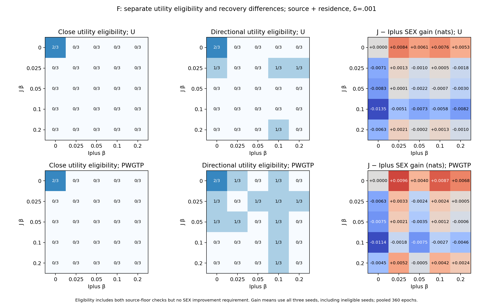
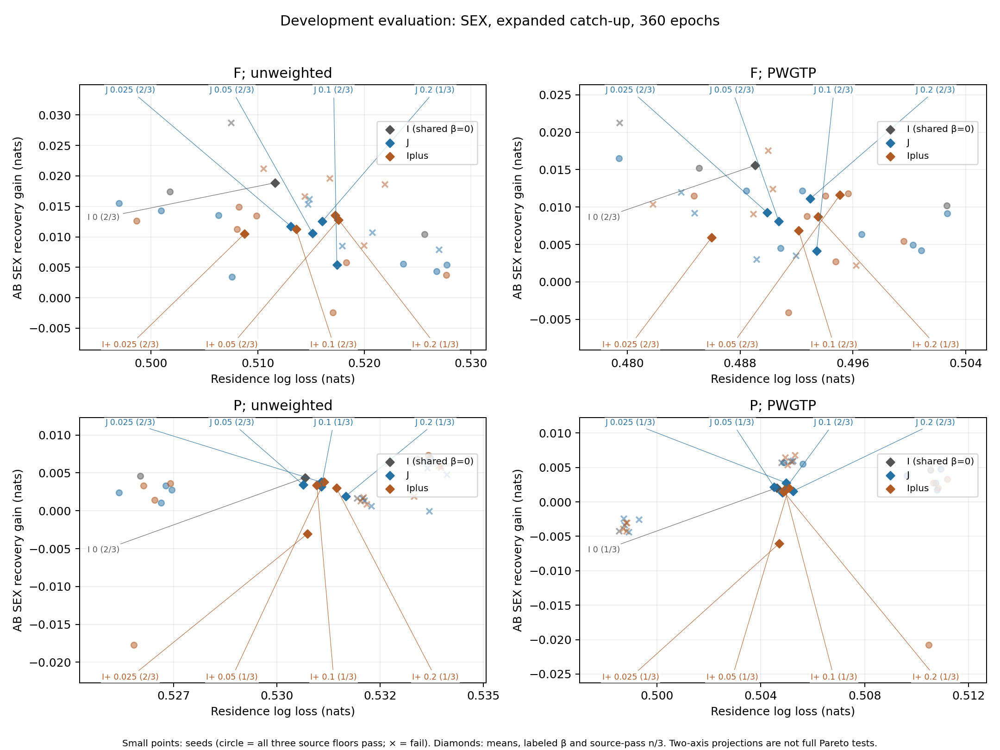
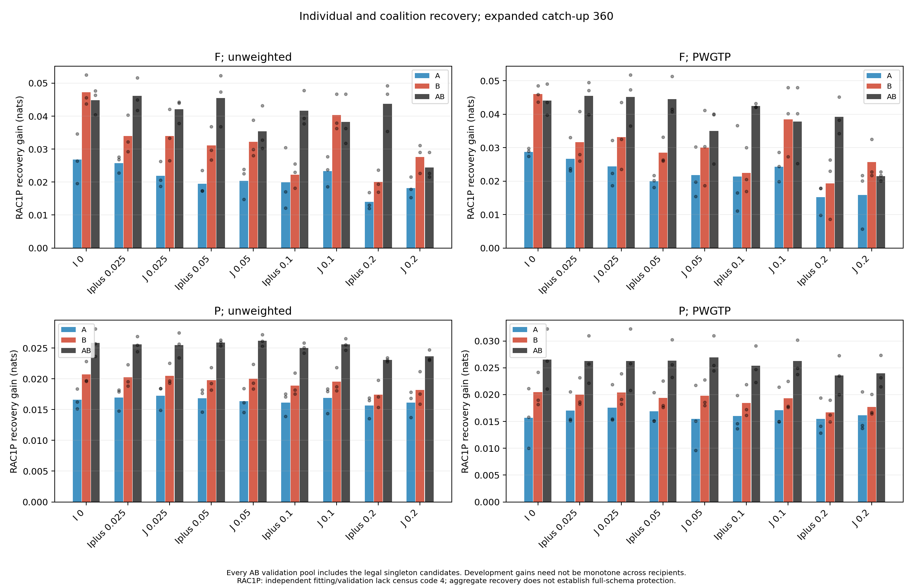
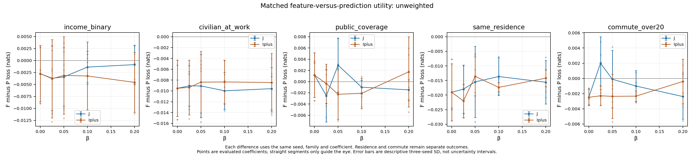

# Analysis of the fixed coalition-strength grid

The fixed grid does not establish a feasible, closely matched F coalition-SEX advantage. It does show that J can lower pooled SEX recovery at a particular coefficient, with source, reserved-task and individual-disclosure costs that depend on the comparator. The useful distinction is between a numerical effect at a point, a utility-eligible paired effect, and a full measured tradeoff improvement.

## All local comparators for the strongest pooled F SEX point

The following table inspects F J .1 against **every** predeclared local coefficient. It is an analysis contrast, not a selection of J .1 for release. U / W are the same predictions scored unweighted / PWGTP. Independent means expanded independent here; standard independent has the same SEX values for these comparisons. Differences are J minus Iplus. The last column is the same fixed pair's unweighted primary qualification count.

| Iplus β | Δ AB SEX, pooled U / W | Δ AB SEX, independent U / W | Δ residence U / W | Primary close / directional |
| --- | --- | --- | --- | --- |
| 0 | -0.013469 / -0.011413 | -0.011335 / -0.008456 | +0.005794 / +0.004370 | 0/3 / 0/3 |
| 0.025 | -0.005070 / -0.001790 | -0.003559 / -0.001315 | +0.008680 / +0.007442 | 0/3 / 0/3 |
| 0.05 | -0.007336 / -0.007460 | -0.000521 / -0.000014 | -0.000126 / -0.001657 | 0/3 / 0/3 |
| 0.1 | -0.005827 / -0.002704 | -0.003650 / -0.001374 | +0.003820 / +0.001279 | 0/3 / 0/3 |
| 0.2 | -0.008161 / -0.004576 | +0.000034 / +0.000015 | +0.000177 / -0.000107 | 0/3 / 0/3 |

Every pair has 0/3 primary qualifications. At seed 1, both systems fail the public-coverage source floor. At seeds 0 and 2, the exact task-specific exclusion reasons differ by comparator; [the full 25-pair table](MATCHING_ANALYSIS.md#every-local-comparator-for-each-primary-f-j-point) lists them without dropping failures. [UTILITY_MATCHES.csv.gz](UTILITY_MATCHES.csv.gz) retains close and directional reasons, all five task differences, all eleven recovery differences, both weightings and all three audit scopes.

F J .1 versus Iplus .2 is particularly informative. Its mean residence difference is only +.000177 unweighted and −.000107 weighted, but the unweighted per-seed residence differences have SD .005812; averaging hides utility mismatch and source failures. The pooled SEX difference is −.008161 ± .003334, whereas independent SEX differs by +.000034. J's lower pooled recovery therefore does not persist against the stronger local comparator under a different, separately reported audit scope.

## Feasibility and matching are different constraints

Every one of the 18 fixed systems fails seed 1's public-coverage floor under both weightings. Coverage exceeds the original PCA32 +.01 allowance by .002091–.009765 unweighted and .005896–.015370 weighted. Source feasibility is based on the three independent selected 2,048-label heads, not native heads or a source-loss average. [SOURCE_FEASIBILITY.json](SOURCE_FEASIBILITY.json) keeps the original same-seed/weight parent values and every task check; [NATIVE_SOURCE.md](NATIVE_SOURCE.md) reports the training heads separately.

At δ=.001 in the unweighted F source-only panel, one nonidentical pair is close eligible in one seed, but no pair combines that eligibility with lower SEX recovery. Adding residence removes even that nonidentical close overlap. The shared β=0 self-comparison remains eligible wherever I passes its source floor, but cannot have strictly lower recovery than itself. The no-match finding is therefore not a claim that J and local methods have identical utility.

Directional comparisons answer a different question. In the primary unweighted residential panel, only J .025 versus I at seed 2 qualifies. Its three source losses and residence loss all improve, but commute loss increases by .005389, so it fails the full five-task panel at δ=.001. Weighted F comparisons produce a few other one-seed directional findings; none is a three-seed result. P has substantially more close utility overlap and several one-seed findings, yet no fixed pair qualifies in all three seeds.

Sensitivity at δ=.002 makes more pairs eligible. For example, unweighted F J .05 versus I qualifies for close source-only utility in 2/3 seeds. In the full five-task panel, three unweighted F fixed pairs qualify in one seed each. These are the predeclared sensitivity results, not substitutes for the primary δ=.001 rule. [MATCHING_ANALYSIS.md](MATCHING_ANALYSIS.md) reports every panel and all four δ values; means and SDs always include all three seeds, including ineligible ones.

## Coalition recovery can conceal individual disclosure costs

For F J .1 minus F Iplus .2, the following pooled 360-epoch mean gain differences show why a coalition SEX improvement is not a complete privacy/utility result. Negative gains favor J; positive gains mean greater recovery from J.

| Forbidden role | Unweighted Δ gain | PWGTP Δ gain |
| --- | --- | --- |
| A public coverage | +.001324 | +.002696 |
| A commute | +.000407 | +.000561 |
| A SEX | −.003521 | −.006236 |
| A RAC1P | +.009403 | +.009100 |
| B income | +.005336 | +.005480 |
| B employment | +.001133 | −.003841 |
| B residence | +.001039 | +.000120 |
| B SEX | +.001100 | +.000403 |
| B RAC1P | +.020291 | +.019164 |
| AB SEX | −.008161 | −.004576 |
| AB RAC1P | −.005477 | −.001375 |

All five utility components and all eleven forbidden roles were retained in the full-vector check. Across the 300 per-seed J/local pairs covering both interfaces and weightings at pooled 360, **none** has J componentwise dominate Iplus on that complete vector. This uses the frozen 1e−12 roundoff tolerance, not δ. High-dimensional nondominance and two-axis plots do not prove superiority. [VECTOR_TRADEOFF.csv](VECTOR_TRADEOFF.csv) identifies each worsening component; [NONDOMINATED_POINTS.csv.gz](NONDOMINATED_POINTS.csv.gz) keeps all explicit vector definitions, single-seed and mean frontiers separately. Aggregate race values remain numerical descriptions with incomplete category support.

## Residence capability, commute capability and the old parent

At J .1, F minus P residence loss is −.013650 ± .006464 unweighted and −.011420 ± .007752 weighted. The fixed .01 residence-advantage reference passes in 2/3 unweighted seeds and 1/3 weighted seeds. F minus P commute loss is only −.001000 ± .002022 and −.000821 ± .002513, respectively; its .01 advantage reference passes in 0/3 seeds under either weighting. These are separate task findings.

The additional AB race gain is +.012700 ± .007959 unweighted and +.011563 ± .008743 weighted. The .005 extra-race-gain numerical reference fails in 3/3 unweighted seeds and 2/3 weighted seeds. Combining each task's .01 advantage with both attribute-gain inequalities yields 0/3 numerical joint successes for residence and 0/3 for commute, under both weightings. Full race support would still be required even if the numerical inequalities passed. [feature_capability.json.gz](feature_capability.json.gz) retains A-only/B-only and AB access separately, and compares direct E separately from the matched P interface.

The original residential-retention denominator is the original PCA32 headroom over the better of the two unprotected rich banks, on each seed and weighting. The half-headroom reference passes only for F Iplus .025 and F J .05 in one unweighted seed each, and F J .05 in one weighted seed. All other systems, including direct E, pass in 0/3. Undefined denominators, signed fractions and failures remain in [criteria.json.gz](criteria.json.gz). No parent, margin or task threshold was replaced to obtain a favorable interpretation.

Direct E remains useful context: residence loss .50838 unweighted / .48616 weighted and commute .68724 / .68969, but source floors pass in 0/3 seeds and race gain is .05271 / .04623 under the displayed audit. Named PCA32/PCA16 and rich/source-bank references retain their actual historical audit budgets. Their purpose routing, source weights, interfaces and exposure differ, so they cannot replace matched F/P comparisons. See [CONTEXTUAL_REFERENCES.md](CONTEXTUAL_REFERENCES.md).

## Audit scope, budget and inherited exposure

For the 36 new systems, catch-up is the pooled winner in 212 of 324 observer-eligible role cases at 360 epochs; equivalently, 212 of all 396 roles, including 72 reserved-target roles without saved observers. Of those 212 winners, 39 select epoch 0. The separate saved-adversary diagnostic is excluded from selection; its identical predictions remain legitimately eligible as epoch 0 inside catch-up. A pooled improvement over fresh auditors need not be an improvement caused by additional optimization. The representation-fitting exposure of the saved observers and of public source heads remains disclosed.

From 120 to 360, selected checkpoints/candidates change for 41 new standard-independent, 47 expanded-independent and 38 pooled role cases. Development loss improves in 17/17/16 and worsens in 24/30/22 of these, respectively. All new F pooled selections are unchanged, so the highlighted F pooled finding is not reversed by this longer budget. Across the entire fixed comparison cube, 229 qualification rows change; these overlapping panel/scope/weight conditions are not independent discoveries. [AUDIT_REVIEW.md](AUDIT_REVIEW.md), [AUDIT_BUDGET.csv](AUDIT_BUDGET.csv) and [PAIR_BUDGET_CHANGES.csv](PAIR_BUDGET_CHANGES.csv) report the exact changes.

The negative mean SEX gain for P Iplus .025 deserves a specific caveat. Seed 0 selects a minimum-leaf-5 tree by attacker-validation loss; its development loss .710602 exceeds the prior's .692902, producing gain −.017700. This same selection appears at both budgets and all scopes. The negative mean is retained as an auditor generalization failure, not relabeled as nonrecoverability. Prior/exposed controls and their failures remain in the published candidate evidence.

Census race code 4 is absent from the independent fitting and validation pools. Saved observers' representation-fitting pool has 1/1/0 examples across seeds. Extra training cannot fill the independent support gap, and inherited exposure does not turn it into a complete independent assessment. Every category remains reported. There is no claim of privacy, arbitrary-side-information robustness, a smooth frontier, or fresh-release policy protection.

## Complete evidence and the next design decision

The matrix was globally frozen before new reserved-task or audit fitting. All 54 systems are complete; 36 are new continuations and 18 are hash-bound historical aliases. Scientific compute was 60.37 minutes. Full model/score replay passed, and independent comparison replay checked 57,600 per-seed pairs, 19,200 aggregates, 22,464 Pareto rows and 1,800 full-vector contrasts. No failed or weakly audited arm was omitted. Actual counts, hashes, progress and runtimes are linked in [the decision](RESEARCH_DECISION.md), [VALIDATION.md](VALIDATION.md) and [REVIEW_COMPARISONS.md](REVIEW_COMPARISONS.md).

The next method should first test whether source feasibility can be repaired while preserving a fair coalition/local comparison. [NEXT_DESIGN.md](NEXT_DESIGN.md) proposes exactly one finite source-guarded update experiment with strong local and prediction-interface controls, including a source-only diagnostic. It retains the independent source floor and reserved-task holdouts; it does not assume a training-gradient condition guarantees downstream utility.

Additional figures: [race tradeoff](figures/tradeoff_RAC1P.png), [all task levels U](figures/utility_unweighted.png) / [W](figures/utility_person_weighted.png), [equal-strength utility](figures/equal_strength_utility.png) / [coalition SEX/race contrasts](figures/equal_strength_recovery.png), [close](figures/matching_close.png) / [directional](figures/matching_directional.png) matching, [P eligibility](figures/eligibility_and_SEX_P.png), [individual/coalition SEX](figures/individual_coalition_SEX.png), [audit scopes](figures/audit_scopes.png) / [budgets](figures/audit_budget.png), [AB SEX scope detail](figures/selected_scopes_AB_SEX.png) / [B race scope detail](figures/selected_scopes_B_RAC1P.png), [weighted feature differences](figures/feature_minus_prediction_person_weighted.png), [native/probe differences](figures/native_minus_probe.png), and [actual gradient norms](figures/gradient_norms.png). Lines connect only evaluated coefficients as visual guides; three-seed SD bars are descriptive.

[Complete individual-target tables](INDIVIDUAL_TARGETS.md) give all nine A/B forbidden-role gains for every fixed condition under both weightings.
