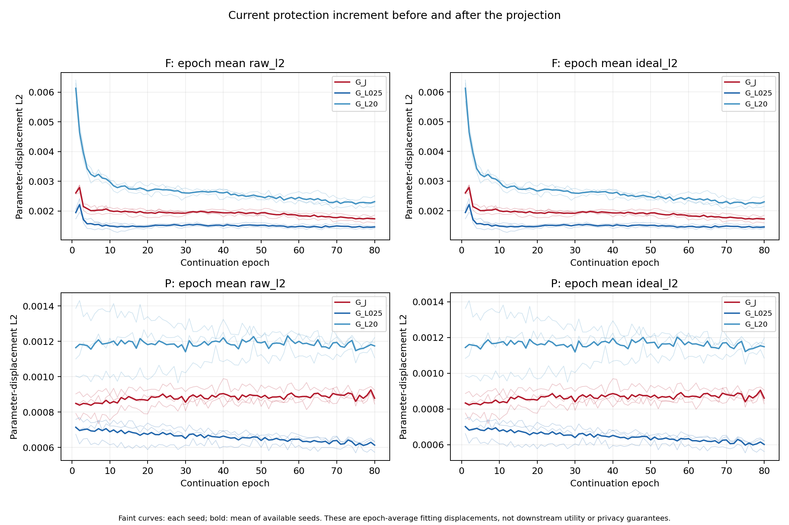
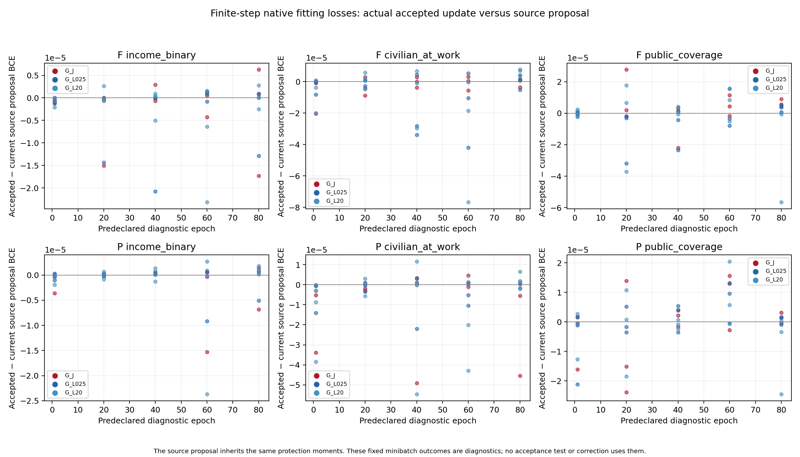

# The guard worked locally; that is a different question from source feasibility

The numerical mechanism executed as declared on all **60,000 guarded parameter transitions**. A nonempty active set was used on 96.61–97.80% of updates. The projection retained most of the mean raw increment norm: the ratio of mean projected to mean raw increment norm was 99.53–99.58% for F and 97.98–98.09% for P. This ratio of means does not summarize the distribution of update angles. Frequent activation therefore does not mean that most protection displacement was removed. The independent training replay reconstructs all 90 predeclared guarded diagnostic updates and checks all 60,000 compact guard records, including the recorded feasibility and cast bounds. It does not independently reconstruct every full guarded trajectory. Activation counts alone would not establish correctness.

| System | Actual guard steps | Nonempty active set | Mean raw increment L2 | Mean projected increment L2 | Ratio of those means | Fixed-point native task losses higher / lower / equal than current source proposal |
| --- | ---: | ---: | ---: | ---: | ---: | ---: |
| F G-J | 10,000 | 97.02% | .001929 | .001919 | .995263 | 26 / 19 / 0 |
| F G-L025 | 10,000 | 96.61% | .001514 | .001507 | .995837 | 18 / 27 / 0 |
| F G-L20 | 10,000 | 97.04% | .002675 | .002662 | .995279 | 22 / 22 / 1 |
| P G-J | 10,000 | 97.54% | .000882 | .000864 | .980324 | 23 / 22 / 0 |
| P G-L025 | 10,000 | 97.06% | .000659 | .000646 | .980899 | 23 / 22 / 0 |
| P G-L20 | 10,000 | 97.80% | .001185 | .001162 | .979812 | 22 / 23 / 0 |

Norm means weight each epoch by its actual update count. The final column has 45 fixed task checks per condition: three tasks × five predeclared minibatches × three seeds. They are fitting diagnostics on exactly the same minibatch at the current, source-proposal, full-proposal and accepted states. They never select, reject or correct an update. The 134 increases, 135 decreases and one equality across these 270 checks demonstrate why a linearized constraint cannot be described as finite-step native-loss preservation. Differences ranged from −.00007683 to +.00002775 nats. This is not a downstream probe comparison.

The source-only current proposal itself raised an individual task loss on 17/270 checks, although it lowered losses on the other 253. Against the full proposal, guarding lowered task loss on 204 checks, left 52 exactly equal and raised 14; its largest increase was only .00000167 nats. Thus the guard often improved the local full proposal while still offering no guarantee for any individual finite step. The full four-state comparison is:

| Native task loss difference, all 270 checks | Higher / lower / equal | Minimum difference (nats) | Maximum difference (nats) |
| --- | ---: | ---: | ---: |
| Current source proposal − pre-state | 17 / 253 / 0 | −.00516599 | +.00285816 |
| Full proposal − current source proposal | 201 / 69 / 0 | −.00007683 | +.00022051 |
| Accepted − current source proposal | 134 / 135 / 1 | −.00007683 | +.00002775 |
| Accepted − full proposal | 14 / 204 / 52 | −.00020006 | +.00000167 |
| Accepted − pre-state | 17 / 253 / 0 | −.00516081 | +.00286394 |

The source proposal optimizes a weighted sum of three tasks and inherits the current full-gradient moments. These comparisons do not isolate protection-free optimizer history and do not use an acceptance rule. The signs are counts of the exact saved float32 losses; equality is literal equality. Every per-task value is retained rather than replaced by these diagnostic totals.

The largest positive **ideal float64** task dot was 1.02×10⁻¹⁷. The largest positive **stored float32** dot was 4.19×10⁻⁸; every stored residual was within the separately recorded cast and float64 summation bound. The largest stored-dot-minus-bound value was negative (−2.59×10⁻¹²). Outside-support proposals remained identical on every guarded update. These statements concern the projection's declared numerical tolerances, not a 10⁻¹² guarantee after float32 storage. No cast correction was applied.

The guard constrains the current full-minus-source Adam increment. Both disposable proposals start from the same current optimizer state, whose moments contain earlier protection gradients. Keeping the full proposal's moments once means that tomorrow's source-only proposal can still contain that history. It is therefore incorrect to treat the current source proposal as the separate T trajectory. The guard-support dot fields exclude F's ordinary source-head displacement; the explicitly named full-displacement fields include it. Neither version guarantees that the total step improves each task.

The accounting is explicit: **70,000 live forward parameter transitions** comprise 60,000 guarded transitions and 10,000 ordinary live T Adam steps. Guarding requires 120,000 disposable candidate Adam calculations, not 120,000 extra live steps. The two T interfaces share one forward trajectory per seed, while their observer sets remain distinct. All interfaces together receive 240,000 observer updates. These counts are derived from saved initial/final counters and aliases in [TRAINING_COUNTS.csv](TRAINING_COUNTS.csv).

The original T step stream recorded source losses, support and schedules, but omitted displacement norms and dots. A separately frozen reconstruction recovered those diagnostics by replaying the **three existing source-only trajectories / 10,000 verification updates**. Every original source loss, five saved pre/post states, and final model and Adam state matched exactly for both interfaces. No fitted release was replaced, no observer or attacker was refitted, and no reserved label was read. T has no active guard: its source/full/accepted proposal states are identical aliases. The supplementary updates count as verification work, with their process time conservatively charged to scientific compute, rather than new fitted systems. See the [supplement plan](T_DIAGNOSTIC_RECONSTRUCTION_PLAN.json), [exact replay certificate](t_source_reconstruction/REPLAY.json) and [T diagnostic rows](T_SOURCE_DIAGNOSTICS.csv).

The independent probe tests in [SOURCE_FEASIBILITY.md](SOURCE_FEASIBILITY.md) decide whether this local mechanism improved usable source information. Native source-validation examples and downstream probe-validation examples are different pools; development comparisons use the same held examples. The mechanism alone supports no claim of generalization, transfer, privacy, or superiority over either fixed guarded local comparator.

[Per-epoch evidence](GUARD_EPOCHS.csv.gz), [fixed-point evidence](GUARD_DIAGNOSTICS.json.gz), [finite-step task differences](GUARD_NATIVE_CHANGES.csv), [all-step numerical summaries](GUARD_ANALYSIS.md) and [independent validation](VALIDATION.md) retain the full numerical record.

