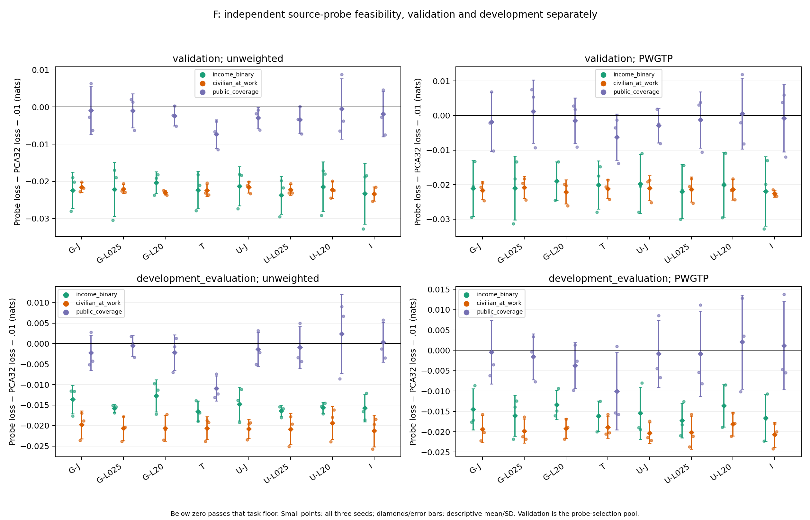
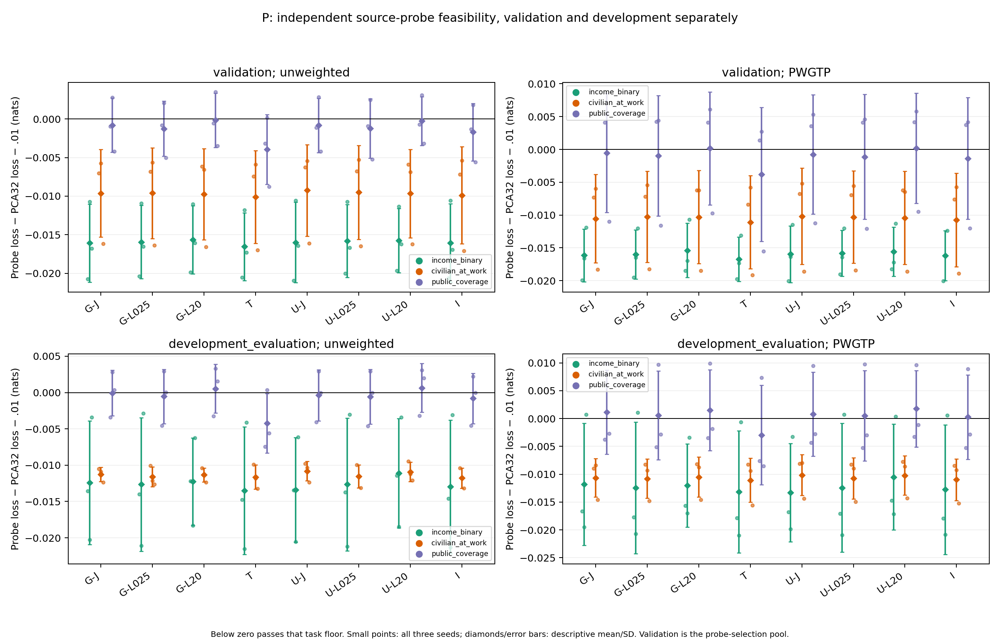

# Source feasibility: the source-only feature control passes unweighted; no guarded system passes all seeds

The fixed source-only **F-T** control meets all three independent source-probe floors in all three seeds on both downstream validation and development evaluation, unweighted. None of the six guarded F/P systems meets every development source floor in all three seeds under either weighting. Guarding sometimes repairs an individual failure, but it does not deliver a consistent source-feasibility repair across this matrix.

Each floor is the original **same-seed, same-weight, same-split PCA32 selected source-probe loss + .01 nats**, checked separately for income, employment and coverage. A count below is the number of seeds that pass all three. Validation and development are separate assessments; their conjunction is not the declared criterion. The development households have informed earlier research and remain **DEVELOPMENT EVALUATION**.

| System | Probe validation U | Probe validation PWGTP | Development U | Development PWGTP |
| --- | ---: | ---: | ---: | ---: |
| F-T | 3/3 | 3/3 | 3/3 | 2/3 |
| P-T | 2/3 | 1/3 | 2/3 | 2/3 |
| F G-J | 2/3 | 2/3 | 2/3 | 2/3 |
| F G-L025 | 1/3 | 1/3 | 1/3 | 2/3 |
| F G-L20 | 2/3 | 1/3 | 2/3 | 2/3 |
| P G-J | 2/3 | 1/3 | 1/3 | 1/3 |
| P G-L025 | 2/3 | 1/3 | 1/3 | 1/3 |
| P G-L20 | 2/3 | 1/3 | 1/3 | 2/3 |

**Every condition, seed, task loss, parent ceiling and pass flag** is readable in [PER_SEED_UTILITY.md](PER_SEED_UTILITY.md), including validation and both weightings. The [complete selected scores](PER_SEED.csv) and [source-floor JSON](SOURCE_FEASIBILITY.json) retain exact values. [TABLE.md](TABLE.md) includes the matched unguarded and ordinary-I references; source averages never replace the three separate tests.

Coverage is the dominant remaining failure. These are development excesses **above the allowed PCA32+.01 ceiling**, not differences from PCA32 itself:

| System | Unweighted failing task/seed: excess (nats) | PWGTP failing task/seed: excess (nats) |
| --- | --- | --- |
| F-T | None | Coverage s1: +.000958492 |
| P-T | Coverage s1: +.000369107 | Coverage s1: +.007324125 |
| F G-J | Coverage s1: +.002747070 | Coverage s1: +.008455365 |
| F G-L025 | Coverage s0: +.001717463; s1: +.000001763 | Coverage s1: +.003359010 |
| F G-L20 | Coverage s2: +.001310091 | Coverage s1: +.001267886 |
| P G-J | Coverage s1: +.002829740; s2: +.000382374 | Coverage s1: +.009808455; income s2: +.000730499 |
| P G-L025 | Coverage s1: +.002918337; s2: +.000004631 | Coverage s1: +.009724198; income s2: +.001052726 |
| P G-L20 | Coverage s1: +.003280945; s2: +.001549538 | Coverage s1: +.009871643 |

The small F G-L025 seed-1 and P G-L025 seed-2 excesses remain failures under the frozen 10⁻¹² roundoff rule. They are not rounded into passes. F G-L20 repairs seed 1's unweighted coverage failure relative to its unguarded counterpart, and increases its total source-pass count from 1/3 to 2/3 under each weighting. It still fails a different seed unweighted and seed 1 weighted. F G-J retains its unguarded 2/3 development count; G-L025 lowers the unweighted count from 2/3 to 1/3. These are specific repairs and costs, not a uniform guard effect.

F-T establishes that this fixed architecture, initialization and source-only continuation can meet the **unweighted** probe floors without protection. It does not establish a feasible protected system. Its weighted coverage near miss and P-T's failures show why neither “T passes” nor “T fails” is a complete result. Where T fails, protection is not required for infeasibility under this recipe; capacity, optimization, interface information and generalization have not been separately isolated. Where F-T passes and guarded F fails, this particular current-displacement guard has not repaired the exchange.

## Native fitting objectives and independent probes can disagree

Native heads are fixed training heads, while utility probes are independently fitted logistic/MLP candidates with the original 2,048-label budget. The following development means score the **same held examples**:

| F-T task | Native U | Probe U | Native PWGTP | Probe PWGTP |
| --- | ---: | ---: | ---: | ---: |
| Income | .298066 | .292023 | .309600 | .304414 |
| Employment | .303615 | .277795 | .293035 | .268398 |
| Coverage | .552740 | .503689 | .561262 | .514079 |

F/P-T have exactly the same native source functions, although their feature/probability interfaces support different independent probes. Freezing T's native predictions would therefore not preserve the source-probe behavior that passed the unweighted F-T floor.

The disagreement also appears in paired guard effects. F G-J versus its own unguarded J improves native income/employment losses by −.000374/−.001097 nats unweighted, while independent probe losses worsen by +.001119/+.001002. Conversely, F G-L20's native coverage loss worsens by +.000826 while its probe coverage loss improves by −.004552. The guard's fitting gradients are not an empirical guarantee for the separately trained utility heads. See [native/probe means](NATIVE_SOURCE.md), [every native/probe seed](PER_SEED_NATIVE.md) and [all fixed paired contrasts](PAIRED.csv.gz).

Native **source-validation** and independent probe **downstream-validation** use different household pools. Their validation numbers are separate diagnostics, not losses paired on the same examples. In this frozen study, the new evaluations did not select a mapper, change a guard coefficient or alter stopping. Unweighted downstream validation selected utility heads only; the research direction and fixed recipes still acknowledge prior development outcomes.

## Source feasibility does not exhaust transfer utility

None of the guarded final systems passes the original residential half-headroom reference in any seed under either weighting. F-T passes that residence reference in 1/3 unweighted seeds and 0/3 weighted seeds. These denominators retain original PCA32 as the parent and the better historical rich bank as the comparison; negative retention remains signed, and no margin was softened. The guarded feature interfaces nevertheless often beat their own prediction interfaces on residence. That separate, narrower benefit and its attribute/individual recovery costs are assessed in [ANALYSIS.md](ANALYSIS.md); commute is evaluated independently.

